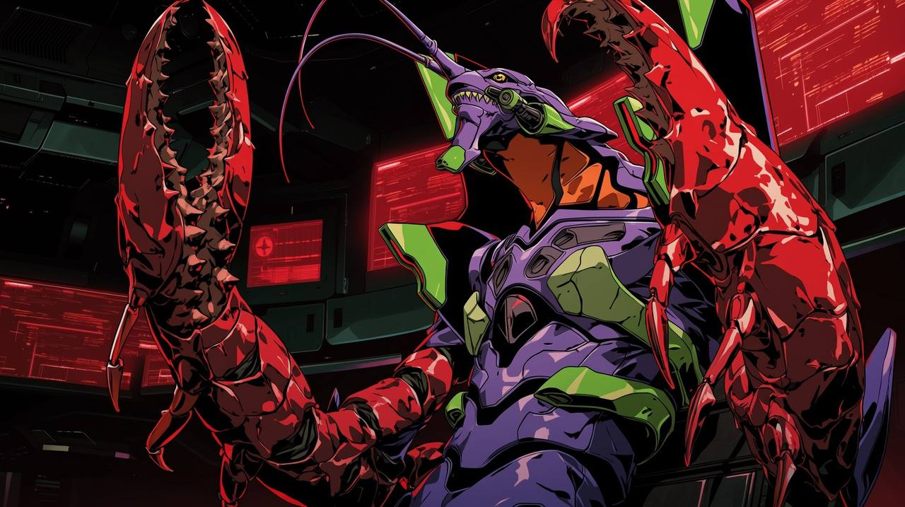

<div align="center">



# plugsuits

**プラグスーツ**

*Plug and go, native like a suit.*

A barebone AI agent harness built on the [Vercel AI SDK](https://sdk.vercel.ai).

[Getting Started](#quick-start) · [Architecture](#architecture) · [Development](#development)

</div>

---

## What is plugsuits?

In *Neon Genesis Evangelion*, a **plugsuit** is the neural interface between a pilot and their Evangelion — form-fitting, minimal, and essential. Without it, synchronization doesn't happen.

**plugsuits** takes the same approach to AI agents. A lightweight TypeScript harness that connects any LLM to code editing, file operations, and shell execution — with nothing more than what's needed.

No framework overhead. No abstraction tax. Just the interface between model and tools.

## Features

- **Any model, any provider** — Drop in models via Vercel AI SDK's unified provider ecosystem
- **Hashline edit engine** — Deterministic file editing with hash-verified line anchors and autocorrect
- **Interactive TUI** — Full terminal UI with streaming, syntax highlighting, and runtime model switching
- **Headless mode** — JSONL event streaming for CI/CD, benchmarks, and automation
- **Tool harness** — File read/write/edit, glob, grep, shell execution — batteries included
- **Repair escalation** — Progressive error recovery for weaker models (validate → auto-repair → lenient fallback)
- **Monorepo** — Clean separation between the harness core and the agent implementation

## Quick Start

### Prerequisites

- [Bun](https://bun.sh) >= 1.0
- A [FriendliAI](https://friendli.ai) API token (or any Vercel AI SDK-compatible provider)

### Run directly

```bash
export FRIENDLI_TOKEN=your_token_here
bunx github:minpeter/plugsuits#main
```

### Local development

```bash
git clone https://github.com/minpeter/plugsuits.git
cd plugsuits
bun install
bun start
```

## Usage

### Interactive mode

```
$ bun start

Chat with AI (model: LGAI-EXAONE/K-EXAONE-236B-A23B)
Use '/help' for commands, 'ctrl-c' to quit

You: what files are in the src directory?
tool: read_file({"path":"src"})
AI: Here's what's in the src directory...

You: /help
Available commands:
  /help       Show this help message
  /clear      Clear conversation
  /model      Switch AI models
  /reasoning  Toggle reasoning mode
  /translate  Toggle translation mode
  /render     Render raw prompt
  /quit       Exit
```

### Headless mode

```bash
bun run headless -- --prompt "Fix the type error in src/index.ts"
```

Outputs structured JSONL events (`user`, `tool_call`, `tool_result`, `assistant`, `error`) for programmatic consumption.

## Architecture

```
plugsuits/
├── packages/
│   ├── harness/              @ai-sdk-tool/harness
│   │   └── src/              Core agent loop, message history, tool management
│   │
│   └── cea/                  @ai-sdk-tool/cea
│       ├── src/
│       │   ├── entrypoints/  CLI (interactive) + headless (JSONL) runtimes
│       │   ├── tools/
│       │   │   ├── modify/   edit_file (hashline engine), write_file, delete_file
│       │   │   ├── explore/  read_file, grep, glob
│       │   │   └── execute/  shell_execute, shell_interact
│       │   └── interaction/  TUI renderer, streaming, spinner
│       └── benchmark/        Harbor terminal-bench adapter
│
└── scripts/                  Benchmark and test automation
```

### Packages

| Package | Description |
|---------|-------------|
| [`@ai-sdk-tool/harness`](./packages/harness) | Reusable agent harness — model-agnostic loop, tool management, message history |
| [`@ai-sdk-tool/cea`](./packages/cea) | Code editing agent — full implementation with TUI, tools, and FriendliAI integration |

## Development

```bash
bun install          # Install dependencies
bun start            # Interactive TUI
bun run headless     # Headless JSONL mode
bun test             # Run all tests (436 tests)
bun run typecheck    # Type check (harness + cea)
bun run check        # Lint — non-mutating
bun run lint         # Lint — auto-fix
bun run build        # Build (harness → cea)
```

## Built With

- [Vercel AI SDK](https://sdk.vercel.ai) — Model provider abstraction and streaming
- [FriendliAI](https://friendli.ai) — Default model provider
- [Bun](https://bun.sh) — Runtime and package manager
- [TypeScript](https://www.typescriptlang.org) — Strict mode throughout

## License

MIT

---

<p align="center">
  <sub>
    The name <b>plugsuits</b> was suggested by <a href="mailto:seojoon.kim@gmail.com">Simon Kim</a> of <a href="https://www.hashed.com">Hashed</a>.
    <br/>
    <i>"Plug and go, native like a suit"</i> — like a plugsuit synchronizing a pilot with their Eva,
    <br/>
    this harness synchronizes AI models with the tools they need.
  </sub>
</p>
